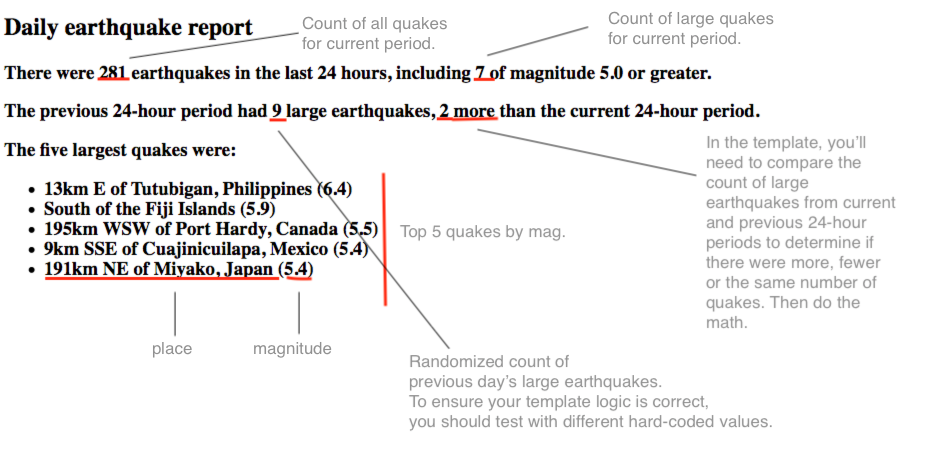

## Quakebot Exercise

For this exercise, we'll practice "semi-automated" journalism by creating a story template populated by [USGS earthquake data][], in the spirt of the Los Angeles Times [Quakebot]().

The exercise includes a sample JSON file (`usgs_all_day.geojson`) as well as a script called `generate_story.py`, which includes the basic code plumbing to generate the story.

Your task is to create and flesh out a [Jinja2][] template called `story_template.html` so that it matches an expected output (see below).

Before creating the template, take a few minutes to review the code in `generate_story.py` and skim the features of Jinja2, in particular the [Template Designer Documentation][].


### Setup & Usage

* Ensure you have `pipenv` installed
* [Fork and clone](https://help.github.com/en/articles/fork-a-repo) this repo

```
cd /path/to/quakebot-exercise
pipenv install

# To run the code, activate the virtual environment
pipenv shell

# Or use python3, depending on your setup
python generate_story.py
```

### Create a story template

Create a Jinja2 HTML template called `story_template.html` in the root of the repo.

The template should generate the output seen in the annotated image below. To complete this work you'll need to understand how Jinja2 variables, "for" loops and "if" blocks work. Before starting to code, it's a good idea to review the [Template Designer Documentation][], which provides a basic HTML structure as a starting point and details on Jinja's major features.

*Note*: The `generate_story.py` script includes a randomizer for the number of earthquakes from the previous day. This was included to nudge you toward using an "if" block to handle different scenarios. As you work through the Jinja2 template, it's a good idea to comment out this randomized number and use hard-coded values to build out the conditional handling incrementally (i.e. a number that matches the current day's count, a number that is lower, and a number that is higher). Once you're confident the conditional logic works as expected, you can restore the randomizer and test the code again.



[USGS earthquake data]: https://earthquake.usgs.gov/earthquakes/feed/v1.0/geojson.php
[Quakebot]: https://slate.com/technology/2014/03/quakebot-los-angeles-times-robot-journalist-writes-article-on-la-earthquake.html
[Jinja2]: http://jinja.pocoo.org/docs/2.10/
[Template Designer Documentation]: http://jinja.pocoo.org/docs/2.10/templates/